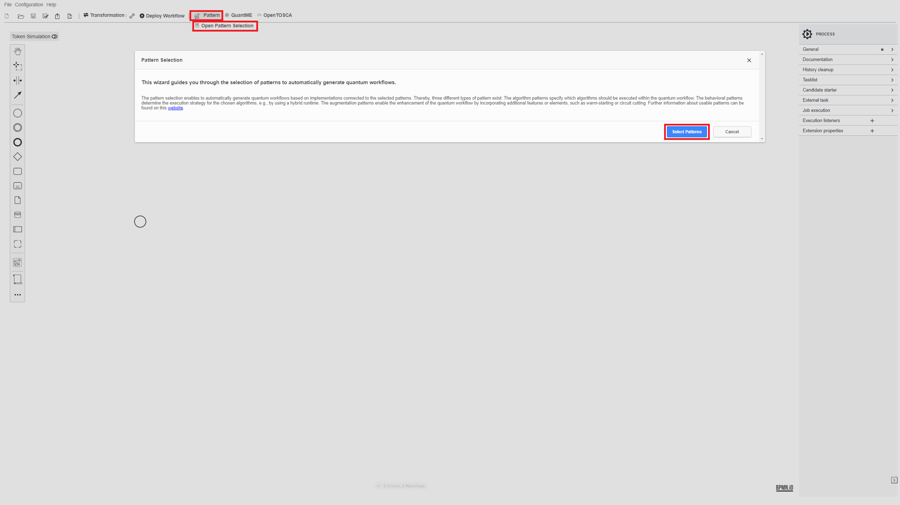
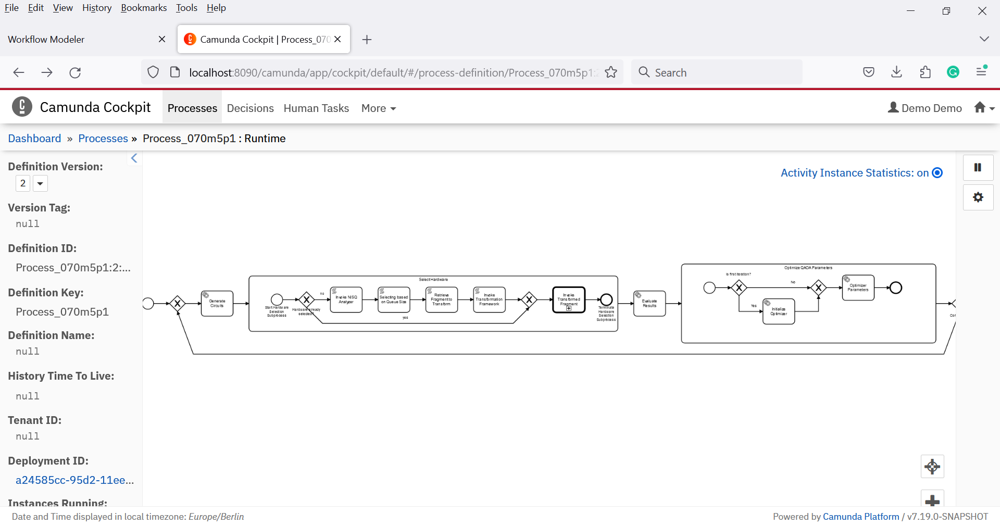

# Anwendungsfälle

Zur Evaluation der praktischen Nutzbarkeit der PASTA-Methode wurden wie in Kapitel 8 beschrieben drei Anwendungsfälle umgesetzt.
Im [ersten Anwendungsfall](./Use-Case-QAOA) wird das Problem des maximalen Schnittes mittels des QAOA-Algorithmus gelöst.
Der [zweite Anwendungsfall](./Use-Case-QML) zeigt wie Kostümdaten aus dem Humantiesbereich mittels des Quantum K-Mean Algorithmus geclustert und mit einer Quantum Support Vector Machine klassifziert werden können.
Zuletzt wird im [letzten Anwendungsfall](./Use-Case-VQE) der VQE-Algorithmus verwendet um Eigenwerte zu bestimmen.

Im Folgenden wird die generelle Vorgehensweise zur Umsetzung der Anwendungsfälle exemplarisch anhand des ersten Anwendungsfall demonstriert.
Details über den zweiten und dritten Anwendungsfall befinden sich in den entsprechenden Ordnern.

Ein Video, welches die Umsetzung der musterbasierten Methode zur Generierung von Quantenworkflows zeigt, ist auf [YouTube](https://youtu.be/6evaPun4HPA) verfügbar.


## Setup

In diesem Abschnitt werden die notwendigen Schritte für das Setup der benötigten Komponenten erläutert.
Alle Komponenten werden als Docker Container bereitgestellt.
Sie können mittels des Docker-Compose files gestartet werden welches [hier](./docker) verfügbar ist.
Dazu müssen folgende Aktionen getätigt werden:

1. Aktualisieren Sie die Einstellungen im [.env](./docker/.env) File:
* ``PUBLIC_HOSTNAME``: Nutzen sie den Hostname bzw. die IP-Adresse ihrer Docker Engine. Benutzen Sie *nicht* ``localhost``.

2. Führen sie das Docker-Compose File wie folgt aus:
```
docker-compose pull
docker-compose up --build
```

3. Warten Sie bis alle container gestartet sind. Dies kann einige Minuten dauern. 

Öffnen sie den Quantum Workflow Modeler über die folgende URL: [localhost:8080](http://localhost:8080)

Danach sollten sie das Folgende in ihrem Browser sehen:


Der Quantum Workflow Modeler ist mit den Endpunkten der Workflow Engine und des QEM Repository vorkonfiguriert.
Um die Einstellungen zu überprüfen, klicken sie auf ``Configuration``. 
Danach öffnet sich das Folgende Pop-Up:


Bitte verifizieren Sie, dass die nachfolgenden Konfigurationsattribute richtig definiert sind.
Dabei muss $IP mit der zuvor beschriebenen IP-Adresse der Docker Engine ersetzt werden.

* Unter ``General``:
    * ``Camunda Engine Endpoint``: http://$IP:8090/engine-rest
* Unter ``GitHub``:
    * ``QRM Repository User``: mbeisel
    * ``QRM Repository Name``: PatternBasedQC-Evaluation
    * ``QRM Repository Path``: qrms-docker

    * ``GitHub Token``: $YOUR_GITHUB_API_TOKEN
    * ``GitHub Repository Owner``: $YOUR_GITHUB_USER_NAME
    * ``GitHub Repository Name``: $REPOSITORY_NAME_THAT_SHALL_BE_USED
    * ``GitHub Repository Path``: $FOLDERNAME_THAT_SHALL_BE_USED
* Unter ``OpenTOSCA Plugin``:
    * ``OpenTOSCA Endpoint:``: http://$IP:1337/csars
    * ``Winery Endpoint:``: http://$IP:8093/winery


### Generierung von Quantenworkflows mittels Mustern

Um einen Quanten-Workflow unter Verwendung der Quantencomputingmuster zu erstellen, klicken Sie auf ``Pattern`` und ``Open Pattern Selection``.
Danach klicken Sie auf ``Select Patterns``.



Danach klicken Sie auf das blaue ``+`` Icon und selektieren sie die folgenden Muster:
* ``Quantum Approximate Optimization Algorithm``
* ``Circuit Cutting``
* ``Biased Initial State``
* ``Readout Error Mitigation``.


Nach Bestätigung der Musterauswahl wird eine Übersicht über die Workflowgenerierung angezeigt.


Als Nächstes klicken Sie auf ``Done`` und dann auf ``Combine Solutions``. 
Nun sollte eine Übersicht über die generierten Workflows mit den angehängten Mustern angezeigt werden.


Der generierte Workflow beginnt mit einem Quantum Circuit Loading Task, welcher den parameterisierten QAOA Schaltkreis generiert.
Danach wird der Schaltkreis mittels eines Quantum Circuit Execution Tasks ausgeführt und anschließend werden die Ergebnisse der Ausführung mit einem Result Evalution Task ausgewertet.
Schließlich werden die Schaltkreisparameter von einem Parameter Optimization Task für die nächste Iteration des Quantenalgorithmus optimiert.
Sobald die Optimierung konvergiert, wird das Ergebnis zur Analyse an der Nutzer übergeben.

Die ausgewählten Verbesserungsmuster (Circuit Cutting, Biased Initial State, and Readout Error Mitigation) sind an den Subprozess angehängt, der den Quantenalgorithmus enthält.
Um die Muster in den Workflow zu integrieren und alle QuantMe-Modellierungskonstrukte in native BPMN-Modellierungskonstrukte zu transformieren, klicken sie auf ``Transformation``.


Um die notwendigen Services bereitzustellen, klicken Sie auf ``OpenTOSCA`` und dann auf ``Service Deployment``.


In dem Pop-up-Fenster werden alle Services angezeigt, die vor der Ausführung bereitgestellt werden müssen. 
Klicken Sie auf ``Upload CSARs``, um alle Deploymentmodelle in OpenTOSCA hochzuladen und anschließend Ihre Bereitstellungsdetails und Credentials anzugeben.


Binden Sie die Services an den Workflow.
Stellen Sie anschließend den Workflow bereit, indem Sie auf die Schaltfläche ``Deploy Workflow`` klicken.


Öffnen Sie die Camunda Engine über die folgende URL: [$IP:8090](http://$IP:8090)
Verwenden Sie ``demo`` als Benutzernamen und ``demo`` als Passwort, um sich einzuloggen, woraufhin der folgende Bildschirm erscheint:


Klicken Sie auf den Home-Button in der oberen rechten Ecke und selektieren Sie ``Cockpit``, um zu überprüfen, ob der Workflow erfolgreich hochgeladen wurde.
Klicken Sie dann oben links auf ``Processes`` und wählen Sie den Workflow aus der Liste aus.
Daraufhin sollte eine graphische Darstellung des hochgeladenen Workflows angezeigt werden:



Um den Workflow zu instanziieren, klicken Sie auf den Home-Button oben rechts und wählen Sie dann ``Tasklist``.
Klicken Sie dann oben rechts auf „Start process“ und wählen Sie den Namen des hochgeladenen Workflows und geben Sie die Eingabeparameter ein:


Die Benutzeroberfläche zeigt unten rechts eine Benachrichtigung an, dass die Workflow-Instanz erfolgreich gestartet wurde.
Klicken Sie anschließend erneut auf den Home-Button oben rechts und wählen Sie Cockpit.
Klicken Sie auf die laufende Prozessinstanz, wählen Sie den gestarteten Workflow aus und klicken Sie dann auf die Workflow-ID.
Nun können Sie den Tokenfluss des Workflows und die sich ändernden Variablen beobachten. 
Um den aktuellen Zustand der Workflow-Instanz zu sehen, aktualisieren Sie die Seite.

Um die Quantenansicht zu aktivieren, in der die QuantME-Modellierungskonstrukte sowie quantenspezifische Provenancedaten, wie z.B. die Kalibrierungsdaten der QPU, angezeigt werden, klicken Sie auf die Schaltfläche Quantenansicht umschalten auf der rechten Seite.


Bewegen Sie den Mauszeiger über die verschiedenen QuantME-Modellierungskonstrukte, um zusätzliche, aufgabenspezifische Daten zu visualisieren:


## Disclaimer of Warranty
Unless required by applicable law or agreed to in writing, Licensor provides the Work (and each Contributor provides its Contributions) on an "AS IS" BASIS, WITHOUT WARRANTIES OR CONDITIONS OF ANY KIND, either express or implied, including, without limitation, any warranties or conditions of TITLE, NON-INFRINGEMENT, MERCHANTABILITY, or FITNESS FOR A PARTICULAR PURPOSE. You are solely responsible for determining the appropriateness of using or redistributing the Work and assume any risks associated with Your exercise of permissions under this License.

## Haftungsausschluss
Dies ist ein Forschungsprototyp. Die Haftung für entgangenen Gewinn, Produktionsausfall, Betriebsunterbrechung, entgangene Nutzungen, Verlust von Daten und Informationen, Finanzierungsaufwendungen sowie sonstige Vermögens- und Folgeschäden ist, außer in Fällen von grober Fahrlässigkeit, Vorsatz und Personenschäden, ausgeschlossen.
